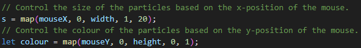
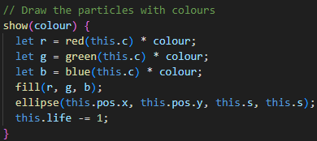

# IDEA9103 Major Project - Functioning Prototype (Individual Part)
## The 'individual_code' folder above contains all necessary files to run the prototype.

- **How to interact**
    - If you open the prototype you will see particles drawing in a beautiful shape that gradually form an image - *The Scream*, though it will look a bit adstract.
    - Moving your mouse left and right can control the size (width) of the drawing particles
    - Moving your mouse up and down can shift the colour between all black and the original one.
    - Clicking your mouse can clear the page and the particles will re-generate.

- **Details of approach**
    - The method I have chosen to modify my group code was the 'User Input'.
    - My code is unique from other members in my group because:
        1. Our group code, as well as my group members' individual code, were designed to be able to interact with the camera on a laptop. However, I do not have a camera on my computer and I had to give up the idea for my own individual code, though I did think it would be more interesting and creative. So my individual code was based on the first and initial iteration of the group code.
        2. The modifications I did to the group code were to change the colour and the size, and made them interactable.
    - I did not make too many changes to the group code: I added commands that identify the X and Y position of the mouse on the canvas, in order to achieve a real-time particles' colour and size changes (image_1). I also modified the colour parameters while particles drawing to make the colour changes executable (image_2).
    
    
